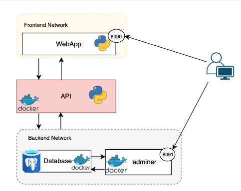

# **Docker Microservices Application**

## **Overview**

This project demonstrates a microservice-based architecture using Docker and Docker Compose.  It integrates multiple technology stacks into a single, containerised system, showcasing real-world deployment practices. The project was developed for **COMP 30520: Cloud Computing** at **University College Dublin**.

---

## **System Architecture**



The system consists of four main components:

- **WebApp (Flask-based frontend)** - Available at [http://localhost:8090](http://localhost:8090)
- **API (FastAPI backend service)** - Internal service running on port `8080`, not directly exposed externally
- **Database (PostgreSQL)** - Internal database for data persistence
- **Adminer (Database management interface)** - Available at [http://localhost:8091](http://localhost:8091)

Services are deployed using **Docker Compose**, with dedicated backend networks ensuring proper isolation between components.

---

## **Technologies Used**

- Python 3.9
  - Flask (Web Frontend)
  - FastAPI (Backend API)
- PostgreSQL (Database)
- Adminer (Database Admin Interface)
- Docker and Docker Compose

---

## **How to Run**

### 1. Clone this repository:

```bash
git clone git@github.com:treasa-murphy/docker-microservices-app.git
cd docker-microservices-app
```

---

### 2. Create a `.env` file in the project root:

```bash
POSTGRES_DB=students
POSTGRES_USER=postgres
POSTGRES_PASSWORD=password
```

_(Make sure these match the environment expected by your API and Database containers.)_

---

### 3. Build and start all services:

```bash
docker compose up --build -d
```

This will:

- Build the images if needed
- Create and start containers for WebApp, API, Database, and Adminer
- Set up networking between services

---

### 4. Access the application:

- **WebApp (Flask Frontend):** [http://localhost:8090](http://localhost:8090)
- **Adminer (Database GUI):** [http://localhost:8091](http://localhost:8091)

The **API (FastAPI service)** is running internally on port `8080`, communicating with the WebApp.

---

## **Important Notes**

- Ensure Docker Desktop is running before starting the application.
- To stop all services, run:

```bash
docker compose down
```

- The FastAPI interactive documentation is available internally (at `/docs`), if accessed from inside the network.

---

## **Course Information**

- **Module:** COMP30520 - Cloud Computing
- **Instructor:** Dimitris Chatzopoulos
- **Teaching Assistant:** John Byabazaire
- **Institution:** University College Dublin (UCD)

---

